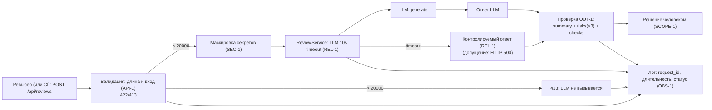

# ADR: решение для первого рабочего сценария

- Статус: accepted
- Дата: 2026-09-14
- Ответственные: Ивакин Александр

## Контекст

Сервис выполняет автоматическое ревью диффов PR с помощью LLM. В учебном диффе реализованы: синхронный POST `/api/reviews`, который принимает словарь и без валидации передает `diff` в `ReviewService.review`, а тот — формирует промпт и вызывает `llm.generate`. Текущая реализация не накладывает лимит на длину diff, не маскирует секреты, не вводит таймаут и возвращает свободный текст. Правила кейса из CASE.md задают требования: SEC-1, API-1, REL-1, OUT-1, SCOPE-1, QA-1, OBS-1.

## Решение

Реализация первого сценария с изменением кода сервиса:
- Лимит diff: при длине > 20 000 символов возвращать 413, LLM не вызывать (API-1).
- Маскировка секретов: перед вызовом LLM заменять токены, пароли и приватные ключи на `[REDACTED]` (SEC-1).
- Таймаут LLM-вызова: 10 секунд; по превышению — контролируемый ответ. Допущение: HTTP 504, тело в формате OUT-1 с summary об ошибке и пустыми risks и checks (REL-1).
- Структурированный ответ: вернуть `summary`, `risks` (не более 3) и `checks` (OUT-1).
- Фильтр рисков: пропускать только риски, подтверждённые строкой diff или правилом (QA-1); максимум три (OUT-1).
- Логи: фиксировать только `request_id`, длительность и статус; не логировать содержимое diff и ответа модели (OBS-1).
- Границы: помощник не выполняет approve/merge и не действует в GitHub; решение принимает человек (SCOPE-1).

## Рассмотренные альтернативы

| Альтернатива | Почему не выбрали сейчас |
|---|---|
| Обрезать diff до 20000 символов вместо 413 | Противоречит API-1; модель видит неполный PR, что искажает анализ |
| Маскировать секреты на стороне LLM-провайдера | Секрет уже покидает периметр; нарушает SEC-1 и увеличивает риск утечек |
| Оставить свободный текст и парсить его | Хрупко и нарушает OUT-1; сложная обработка и нестабильные результаты |
| Асинхронная очередь вместо синхронного ответа | Усложнение; CASE.md этого не требует, достаточно таймаута 10s |

## Последствия и главный риск

- Положительные последствия: предсказуемые ответы, контролируемые ошибки, снижение рисков утечек и издержек.
- Ограничения: максимум три риска в ответе; отказ по размерам > 20 000 символов; формат строго фиксирован.
- Главный риск: пропущенный секрет (ложноотрицательная маскировка) уходит во внешний LLM.
- Как проверим риск: набор тестовых секретов (token, password, private key) и перехват prompt фейковым LLM.

## Архитектурная схема

## Трассировка правил

| Правило | Решение | Тесты (ID) |
|---|---|---|
| SEC-1 | Маскировка токенов/паролей/ключей | U-01..U-03, I-01, E-02 |
| API-1 | Проверка длины и 413 | U-04, U-07, I-02, L-03, E-03, E-05 |
| REL-1 | Таймаут 10s и контролируемый ответ | U-05, I-03, L-01, L-02, E-04 |
| OUT-1 | Структурированный ответ | U-06, I-05, E-01 |
| QA-1 | Фильтр рисков | U-06, I-05 |
| OBS-1 | Ограниченное логирование | I-04 |
| SCOPE-1 | Решение принимает человек | I-06 |

## Как использовали AI

- Для чего: зафиксировать архитектурное решение, альтернативы и последствия в рамках правил кейса.
- Тип промпта: master prompt.
- Строка в [`prompts.md`](prompts.md): P1-03 (генерация артефактов), P1-04 (доработка по ревью), P1-07 (аудит готовности).
- Что проверили и исправили сами: в трассировке исправили ID для OUT-1 (U-06, I-05, E-01) и SCOPE-1 (I-06), добавили U-07, E-05 и L-01; убрали дубль строки про фильтр рисков; на схеме замкнули ветки 413 и timeout на лог и ответ; главный риск — пропущенный секрет; решение сверили с правилами CASE.md.
