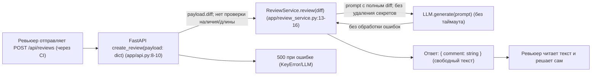
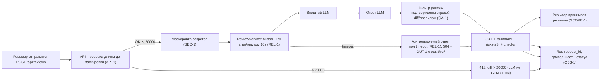

# Анализ процесса: AS IS и TO BE

## AS IS

Передача diff происходит без проверки наличия ключа и длины, секреты не маскируются, LLM вызывается без таймаута, ответ — свободный текст. При отсутствии ключа diff возникает KeyError, что приводит к 500. Ревьюер читает текст и принимает решение сам.

## TO BE

Ревьюер (или CI) отправляет POST `/api/reviews` с diff. API сначала проверяет длину: если diff длиннее 20 000 символов, сервис сразу возвращает 413 и не вызывает LLM (API-1). Если длина допустима, токены, пароли и приватные ключи заменяются на `[REDACTED]` до отправки во внешний LLM (SEC-1). ReviewService вызывает LLM с таймаутом 10 секунд; если модель не ответила, сервис возвращает контролируемый ответ — допущение: HTTP 504 с телом в формате OUT-1 (REL-1). Ответ модели проходит фильтр: остаются только риски, подтверждённые строкой diff или правилом (QA-1), и приводится к формату OUT-1 — `summary`, не более трёх `risks` и `checks`. По каждому запросу в лог пишутся только `request_id`, длительность и статус, без содержимого diff и ответа модели (OBS-1). Решение по PR принимает ревьюер: помощник только советует и не делает approve или merge (SCOPE-1). По сравнению с AS IS исчезают сырые секреты во внешнем LLM, ожидание LLM без ограничения по времени и свободный текст вместо проверяемого ответа.

## Разница

| Что меняется | AS IS | TO BE | Как проверим изменение |
|---|---|---|---|
| Лимит размера | Нет проверки длины | 413 при > 20 000; LLM не вызывается | API-1: U-04, U-07, I-02, L-03, E-03, E-05 |
| Секреты | Сырые данные уходят в LLM | Маскировка [REDACTED] перед вызовом | SEC-1: U-01..U-03, I-01, E-02 |
| Таймаут | Нет | 10s и контролируемый ответ (HTTP 504 + OUT-1) | REL-1: U-05, I-03, L-01, L-02, E-04 |
| Формат ответа | Свободный текст | OUT-1: summary, risks(≤3), checks | OUT-1: U-06, I-05, E-01 |
| Фильтр рисков | Нет фильтрации | Только подтверждённые риски в ответе | QA-1: U-06, I-05 |
| Логирование | Не определено | Только request_id, длительность, статус | OBS-1: I-04 |
| Решение по PR | Неявно | Принимает человек (помощник только советует) | SCOPE-1: I-06 |

## Как использовали AI

- Для чего: визуализировать AS IS и TO BE, подчеркнув ветки 413/timeout, фильтр QA-1 и OBS-1.
- Тип промпта: master prompt.
- Строка в [`prompts.md`](prompts.md): P1-03 (генерация артефактов), P1-04 (доработка по ревью), P1-07 (аудит готовности), P1-08 (исправления по замечаниям ревьюера в PR).
- Что проверили и исправили сами: проверили рендер обеих диаграмм через mermaid-cli (AS IS падал из-за кавычек в подписи стрелки — исправили); ссылку `14-16` поправили на `13-16`; убрали привязку QA-1 к валидации входа; в TO BE выделили выходы 413 и timeout, фильтр QA-1, OBS-1 и решение ревьюера; добавили колонку «Тесты» и сверили ID. По замечаниям ревьюера добавили текстовое описание TO BE и вернули таблице «Разница» колонки шаблона; ID тестов в ней выровняли с трассировкой ADR.
