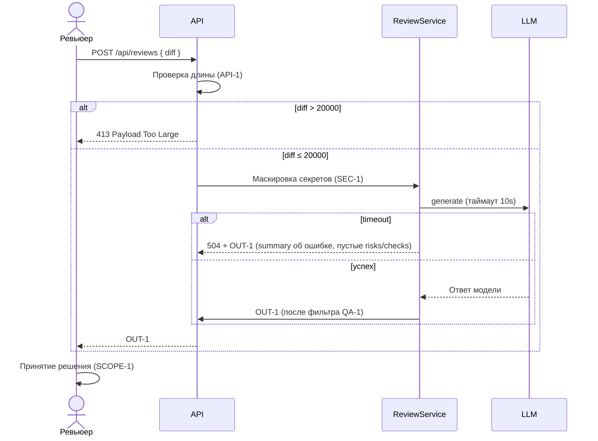

# Use cases и user stories

## Первый рабочий сценарий

**Когда** ревьюер PR (или CI от его имени) отправляет на эндпоинт POST `/api/reviews` JSON с полем `diff` (строка), **система** проверяет лимит длины 20 000 символов (до маскировки), маскирует секреты и вызывает LLM с таймаутом 10 секунд, **а пользователь получает** структурированный ответ, соответствующий OUT-1: `summary`, до 3 `risks` и `checks`. Решение по PR принимает человек (SCOPE-1).

Не входит в этот сценарий:

- Автоматические правки кода и действия в GitHub (SCOPE-1).

## Use case

| Поле | Значение |
|---|---|
| Актор | Ревьюер PR (или CI от его имени) |
| Триггер | Появился diff для ревью |
| Предусловия | Доступен API сервиса; подготовлен JSON с ключом `diff` |
| Основной результат | Возвращён структурированный ответ по OUT-1: `summary`, `risks` (≤3), `checks`; риски отфильтрованы по QA-1 |
| Ошибка или отказ | Если `diff` длиной > 20000 символов — 413 (LLM не вызывается); при таймауте LLM — контролируемый ответ по REL-1 (допущение: HTTP 504, summary об ошибке, пустые risks и checks) |



## User stories и acceptance criteria

- Как ревьюер PR, я хочу получать структурированный ответ с summary/risks/checks, чтобы быстро понять суть замечаний (OUT-1).
- Как ревьюер PR, я хочу, чтобы секреты не уходили во внешний LLM, чтобы не допустить утечек (SEC-1).
- Как ревьюер PR, я хочу, чтобы слишком длинные диффы отклонялись сразу, чтобы не тратить ресурсы (API-1).
- Как ревьюер PR, я хочу, чтобы неподтвержденные риски не попадали в ответ, чтобы не тратить время на шум (QA-1).

```gherkin
Feature: Review diff via API respecting case rules

  Scenario: Позитивный (валидный diff)
    Given API доступен и принимает POST /api/reviews
    And тело запроса содержит diff длиной 1000 символов (фрагмент TRAINING_PR.diff)
    When отправляем запрос
    Then ответ содержит поля summary, risks и checks
    And массив risks содержит не более 3 элементов
    And статус 200

  Scenario: Негативный (diff превышает лимит)
    Given API доступен и принимает POST /api/reviews
    And тело запроса содержит JSON {"diff": "..."} длиной 20001 символ
    When отправляем запрос
    Then ответ имеет статус 413
    And (допущение) тело указывает на превышение лимита по API-1

  Scenario: Граничный (ровно 20000 символов)
    Given API доступен и принимает POST /api/reviews
    And тело запроса содержит JSON {"diff": "..."} длиной ровно 20000 символов
    When отправляем запрос
    Then ответ имеет статус 200
    And тело соответствует OUT-1

  Scenario: SEC-1 (маскировка секретов)
    Given API доступен и принимает POST /api/reviews
    And тело содержит diff с тестовым токеном TOKEN_123
    When отправляем запрос
    Then в перехваченном prompt к LLM вместо TOKEN_123 содержится [REDACTED]
```

## Как использовали AI

- Для чего: описать сценарий, use case, последовательность и критерии.
- Тип промпта: master prompt.
- Строка в [`prompts.md`](prompts.md): P1-03 (генерация артефактов), P1-04 (доработка по ревью), P1-07 (аудит готовности).
- Что проверили и исправили сами: проверили рендер sequence-диаграммы (alt/else/end закрыты; кавычки в метках alt убрали — они выводились на схеме); в ветку timeout добавили 504 + OUT-1; добавили 4 user stories и Gherkin-сценарий SEC-1; убрали противоречие «valid content» длиной 1000 символов; тело ответа 413 пометили как допущение.
