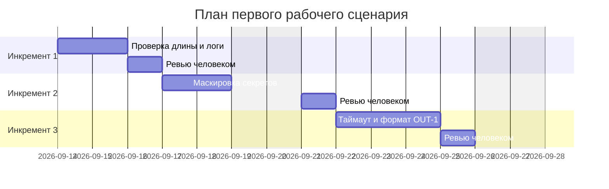

# План поставки

## Инкременты и ответственность

| Инкремент | Наблюдаемый результат | Что делает человек | Что делает AI или субагент | Проверка | Зависимости |
|---|---|---|---|---|---|
| 1: API-1 и OBS-1 | Проверка длины diff и ответ 413; логирование только request_id, длительность, статус | Формулирует требования, ревьюит PR и логи | Подготавливает черновик проверки длины и middleware логирования | U-04, U-07, I-02, I-04, L-03, E-03, E-05 | CASE.md |
| 2: SEC-1 | Маскировка токенов, паролей и приватных ключей перед LLM | Уточняет перечень шаблонов, ревьюит реализацию | Генерирует функции маскировки и тесты | U-01..U-03, I-01, E-02 | Инкремент 1 |
| 3: REL-1, OUT-1, QA-1, SCOPE-1 | Таймаут 10s с контролируемым ответом; формат OUT-1; фильтр рисков; запрет действий | Уточняет формат OUT-1, критерии фильтра; ревьюит PR | Добавляет таймаут/обработку; форматтер OUT-1 и фильтр | U-05, U-06, I-03, I-05, I-06, L-01, L-02, E-01, E-04 | Инкремент 2 |

## Диаграмма Ганта

## Как использовали AI

- Для чего: спланировать поставку функционала по правилам CASE.md.
- Тип промпта: master prompt.
- Строка в [`prompts.md`](prompts.md): P1-03 (генерация артефактов), P1-04 (доработка по ревью), P1-07 (аудит готовности).
- Что проверили и исправили сами: переписали инкременты с заполнения файлов на поставку фичи (API-1 + OBS-1, SEC-1, REL-1 + OUT-1 + QA-1 + SCOPE-1); сверили распределение ID тестов по инкрементам; починили синтаксис Ганта (пропавшие двоеточия) и сдвинули даты с выходных, рендер проверили через mermaid-cli.
